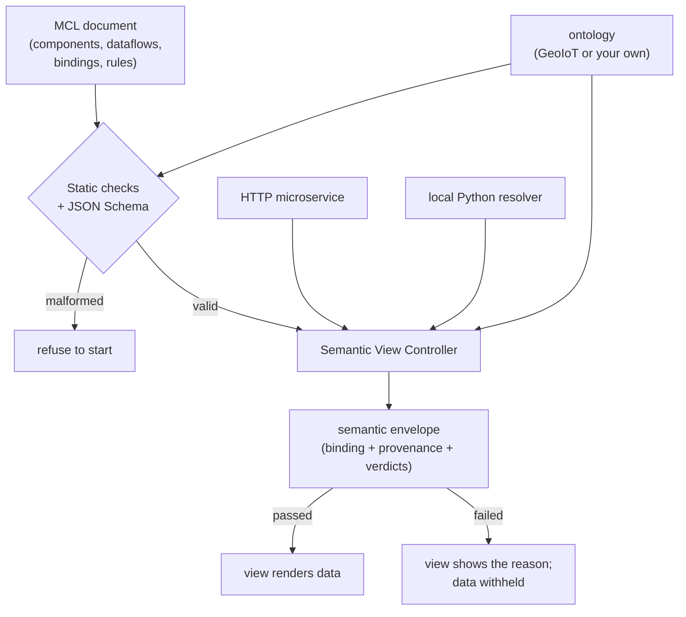

# Architecture

This page shows how the pieces fit, and how MCL positions against the tools you might otherwise reach for.

## The data path

The document is checked once. If it survives, the SVC executes it: for each update it consults the dataflow, fetches from the bound source (an HTTP service or a local resolver), validates against the declared rules, and returns a semantic envelope. Valid data is rendered; invalid data is withheld with its reasons.

## The two implementations

MCL exists in two forms, so it is a language rather than one program:

- **`mclpy`** — the library this wiki documents. You compose in Python or JSON, and serve with an embeddable runtime. Data can come from HTTP services or in-process functions.
- **The MicroMaps deployment** — a larger reference system that fuses five real sources (UK river, weather and grid-carbon feeds, a campus energy archive, and a public air-quality dataset) through one MCL document. It is the evidence that the approach scales beyond toy examples.

## How MCL compares

MCL sits at the intersection of three tool families, and differs from each in a specific way.

| Against | They give you | MCL adds |
|---|---|---|
| **Grafana-as-code, dashboard DSLs** | panels from a config file | concept bindings, load-time checks, render-time validation |
| **Vega-Lite and visualisation grammars** | precise marks, scales, encodings | service composition, interaction and validation (and could embed a grammar per component) |
| **WebDSL and form frameworks** | validation of user *input* | validation of machine-produced sensor *payloads* against ontology-bound expectations |
| **Plain FastAPI + a chart library** | total freedom | the connective code for free, and guaranteed-consistent enforcement |

The distinguishing pair is the **binding** and the **envelope**: a component is attached to a formal concept, not a string label, and every update carries its provenance and verdicts. No tool in the three families above combines declared service composition, domain-concept binding, ontology-checked composition, and render-time payload validation. That combination is the contribution.

## What it costs

Honesty about the trade-offs. The runtime interprets the document rather than compiling it, and that interpretation has not been benchmarked against code generation. Debugging a declaration needs tooling; the envelope inspector is a first step. The validation rule set is deliberately small and closed, so expressiveness is bounded by design, and anything needing cross-record evidence belongs to another layer.

## Next

- [The research behind it](research.md): the papers, the evaluation, the citations.
