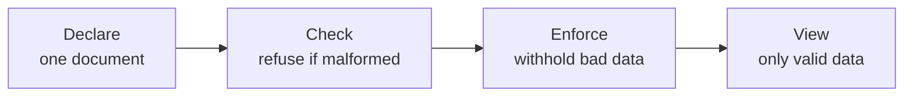

# Declare, check, enforce

This is MCL's whole idea in three words. Everything else is detail. If you take one page from this wiki, take this one.

## The claim

The connective code in a dashboard, the orchestration, the interaction wiring, and the validation, does not need to be *programmed*. It can be **declared** in a document, **checked** against a domain ontology before it runs, and **enforced** automatically at run time. Doing this removes code, contains the cost of change, and stops faulty data at the point of use.

Let us take the three verbs one at a time.

## Declare

You write one document that states *what the interface is*, not *how to build it*. Components, where their data comes from, what concept each represents, what rules its data must satisfy, and how they interact. That is a declaration, like HTML or a Kubernetes manifest, not a script.

The difference matters because a declaration can be inspected and reasoned about. A pile of procedural fetch-and-render code cannot tell you, without running it, whether it is internally consistent. A declaration can.

## Check

Because the composition is a declaration, a machine can verify it before anything executes. When you call `check()`, MCL runs the document through its JSON Schema and then through a set of [static checks](../reference/static-checks.md): every dataflow points at a real service, every component is fed exactly once, every bound concept exists in the ontology, every unit rule agrees with its binding.

If any check fails, the runtime refuses to start and tells you which check and where. A misspelled concept, a dataflow pointing at a component that does not exist, a unit rule that contradicts its own binding: all of these become load-time errors instead of run-time surprises or, worse, silent wrong behaviour.

## Enforce

At run time, the runtime (the Semantic View Controller) mediates every update. It fetches the data from the bound source, applies the component's validation rules, and only then decides what the view sees. A payload that passes is rendered. A payload that fails is *withheld*, and the reasons are returned instead.

Enforcement is automatic and total. You do not call the validator; you cannot forget to. Once a rule is declared, it runs on every update to that component, forever, without another line of code.

## Why this beats writing it by hand

Consider adding a validation check to a hand-written dashboard. You write a function, remember to call it in every code path that renders that chart, handle the failure case in each, and keep all of that in sync as the dashboard grows. Miss one path and the check silently does not run there.

In MCL you write the rule once, in the document, beside the thing it protects. The runtime guarantees it runs everywhere that component is updated. The authors measured this: for one dashboard, the declarative version needed 49% less developer-written code than a behaviourally identical hand-written one, and the largest saving was exactly this validation boilerplate.

## The shape of the guarantee

Put the three verbs together and you get a chain of guarantees:

A malformed interface never starts. A well-formed interface never shows data that violates its own declared rules. Between those two guarantees, there is very little room for a dashboard to lie.

## Next

- See the guarantee in the output: [The semantic envelope](semantic-envelope.md).
- Do it yourself: [Tutorial 1](../tutorials/first-dashboard.md).
