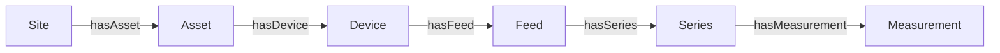

# GeoIoT in one picture

MCL ships with a ready-made ontology called **GeoIoT**. It is the default vocabulary, so you can bind components to real concepts from day one without writing any Turtle. This page shows you the whole thing.

## The chain

GeoIoT models sensor data as a chain, from the place being observed down to a single reading:



Read it left to right:

- **Site** — a place under observation: a campus, a river gauging station, a city region.
- **Asset** — something at the site that carries sensors: a building, a weather mast, a gauge installation.
- **Device** — a sensor on the asset.
- **Feed** — one stream of readings from a device, for one observed property, in one unit. "Building 12's electricity in kW" is a feed.
- **Series** — the time-ordered collection of readings in a feed.
- **Measurement** — a single timestamped value.

Every concept has a URI under `http://www.geoiot.org/ontology#`, so `GEOIOT.Site` is `...#Site`, `GEOIOT.Series` is `...#Series`, and so on.

## What you bind to, in practice

Most components bind to two concepts:

- A **map** binds to `GEOIOT.Site`. Its data is the set of observed places, with coordinates.
- A **chart** binds to `GEOIOT.Series`. Its data is the readings over time, with a `parameter` (what is measured) and a `unit`.

```python
.map("sitemap", concept=GEOIOT.Site, title="Monitored sites")
.timeseries("power", concept=GEOIOT.Series,
            parameter="electricity", unit="kW", title="Building power")
```

That is enough to build most dashboards. The concepts in between (`Asset`, `Device`, `Feed`) matter to the data layer that produces the readings, not usually to the component you are declaring.

## When GeoIoT fits, and when to bring your own

**GeoIoT fits** whenever your data is "readings from sensors at places": energy, environment, water, air quality, weather, traffic, building management. If you can phrase your data as *site → device → feed → series*, GeoIoT is a natural fit and you should just use it.

**Bring your own** when your domain has its own established vocabulary or concepts GeoIoT does not model: a clinical ontology, a logistics ontology, a schema your organisation already maintains. MCL's ontology layer is pluggable, so swapping GeoIoT for your own vocabulary is a one-line change. [Tutorial 3](../tutorials/own-ontology.md) shows exactly how, and proves the swap works by checking a composition against a custom ontology and watching it correctly reject against GeoIoT.

## The provenance and quality extras

GeoIoT also carries a few properties that make data trustworthy, which the data layer fills in: an explicit `unit` on every feed and measurement, a plausible range, the source system each record came from, and (for interpolated data) what fraction was estimated rather than measured. You do not declare these; they arrive with the data and the [semantic envelope](semantic-envelope.md) surfaces them.

## Next

- [Declare, check, enforce](declare-check-enforce.md): how bindings turn into guarantees.
- Or just start building: [Tutorial 1](../tutorials/first-dashboard.md).
