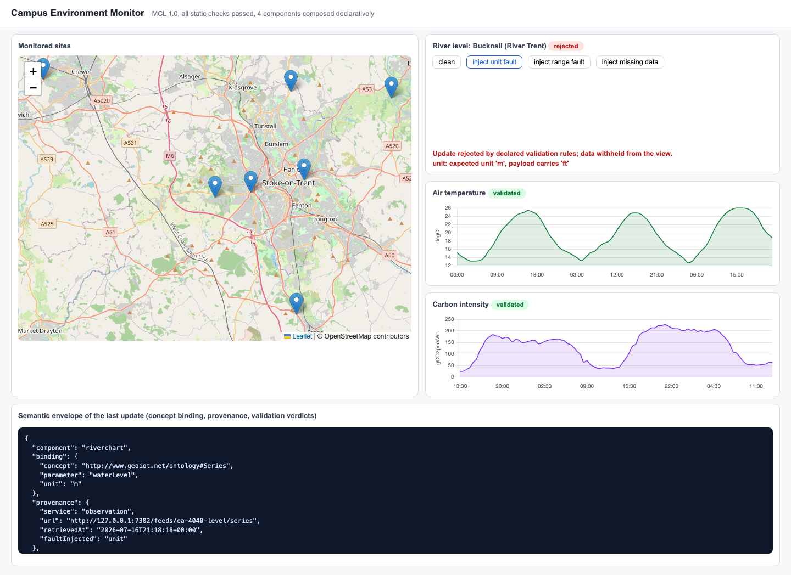

# MCL: declare dashboards you can trust

**In 15 minutes you will run a dashboard that refuses to render bad data, and you will know why that matters.**

---

## The problem, in one story

A sensor feed silently switches from kilowatt-hours to watt-hours. Every number is now 1000 times too small. Your dashboard does not notice. It draws a smooth, believable, completely wrong line, and someone makes a decision based on it.

This is not a rare bug. Reviews of real Internet-of-Things sensor data find missing values, outliers, drift and unit errors everywhere. Most tools try to clean these problems upstream, in the data pipeline. But the pipeline is not the last line of defence. **The interface is.** It is the final place a bad value can be caught before a human sees it, and it is usually the one layer with no idea what "correct" even means.

MCL fixes that. You *declare* what each chart is supposed to show, including its unit and its plausible range. The runtime *checks* that declaration before anything starts, and *enforces* it on every update. When a payload violates the rules, it is withheld from the view and you are told exactly why.

<figure markdown>
  { loading=lazy }
  <figcaption>A wrong-unit payload, caught and withheld. The chart shows the reason, not the fault.</figcaption>
</figure>

## What MCL is

**MCL** (the Microservice Composition Language) is a small declarative language. You write one JSON document that says what components an interface has, where each gets its data, which real-world concept it represents, and what rules its data must satisfy. That is the whole language.

**SVC** (the Semantic View Controller) is the runtime that executes the document. It refuses to start if the document is malformed, and at run time it validates every update, stamps it with where it came from, and wraps it in a *semantic envelope* you can inspect. Bad data never reaches the screen.

You do not need to know anything about ontologies, RDF, or the semantic web to use it. The [Foundations](foundations/why-dashboards-lie.md) pages teach the few ideas you need, in plain terms, and you can use MCL with the built-in vocabulary and never write a line of Turtle.

## Three ways in

-   :material-rocket-launch: **Just show me**

    ---

    Install it and see a rejection happen on your own machine.

    [:octicons-arrow-right-24: Install and quickstart](start/install.md)

-   :material-help-circle: **What is this, really?**

    ---

    The problem, the ideas, and the jargon, explained for developers.

    [:octicons-arrow-right-24: Why dashboards lie](foundations/why-dashboards-lie.md)

-   :material-chart-box: **I already use Grafana**

    ---

    See what MCL adds that dashboard tools do not, and what it does not do.

    [:octicons-arrow-right-24: Coming from Grafana](start/from-grafana.md)

## Who made this and why

MCL comes from PhD research at Keele University on making heterogeneous geospatial and IoT data trustworthy end to end. It is described in a peer-reviewed paper and backed by two open implementations: a five-source live deployment and the `mclpy` Python library this wiki documents. See [The research behind it](explanation/research.md) for the papers and how to cite them.

!!! note "Status"
    `mclpy` v0.2 is the current release. MCL v1.0 (validation) is stable. MCL v2.0 (policy marks, the OOON layer) ships as a clearly-labelled **preview** you can already run; see [Tutorial 5](tutorials/policy-marks.md).
